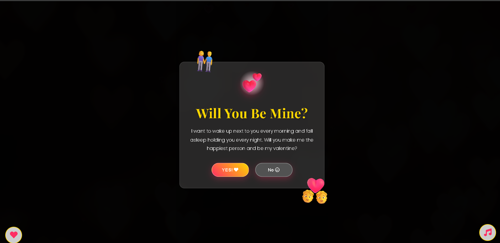

# PROPOSSAL-WESBITE

A beautiful, interactive Valentine's Day proposal website with romantic animations and effects.

## Features ✨
- Romantic animated background
- Interactive step-by-step proposal
- Heartbeat animations
- Fireworks and confetti effects
- Floating hearts and rose petals
- AR heart element (conceptual)
- Custom cursor effects
- Responsive design

## Technologies Used 💻
- HTML5, CSS3, JavaScript
- Custom animations and effects
- Web Audio API for music

## Credits 🙏
- **Created by**: Kratoz Xypher
- **Special Thanks**: AI assistance (~30%) for animations and visual effects

## Installation & Usage 🚀
1. Clone the repository
2. Open `proposal.html` in your browser
3. Customize with your own photos and messages
4. Share with your special someone!

## License 📄
This project is open source and available under the [MIT License](LICENSE).

---

Made with ❤️ by Kratoz Xypher  
Special thanks to AI for assisting with ~30% of animations and visual effects
